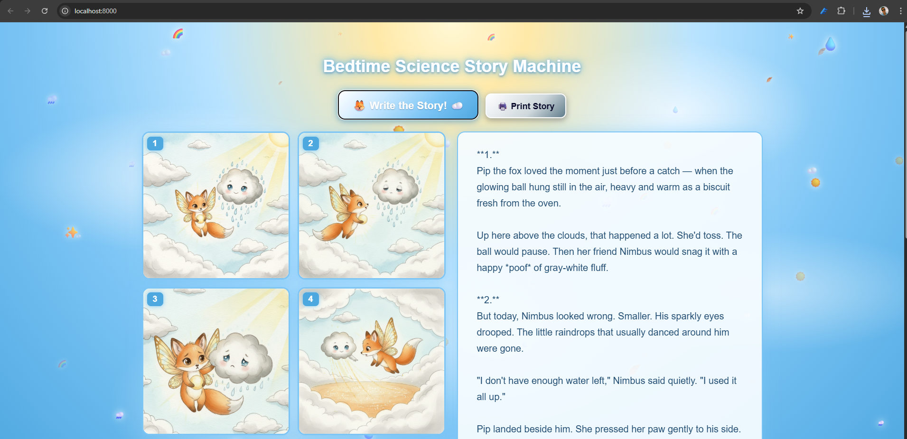
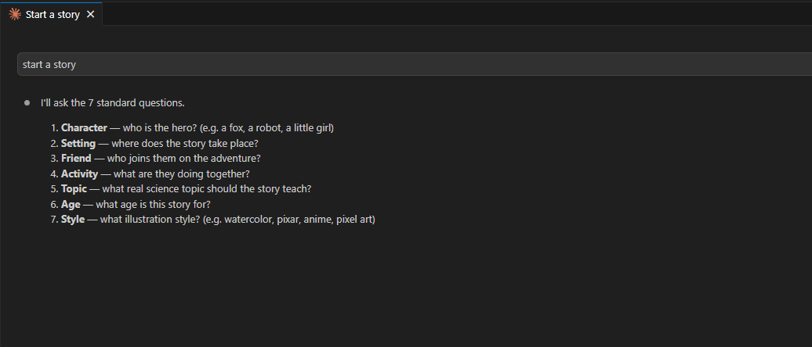
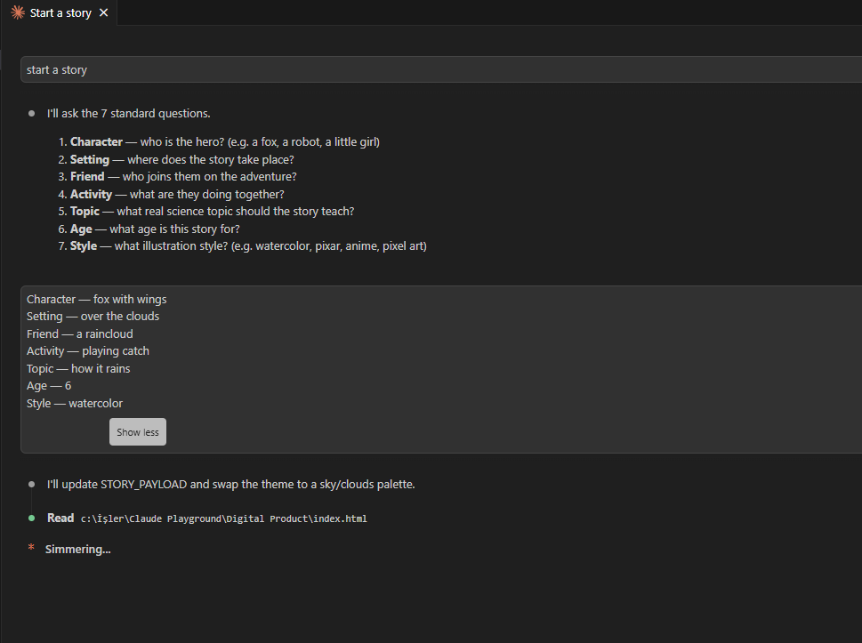

# Bedtime Science Story Generator

A tiny live-coding toy for kids: ask 7 questions (character, setting, friend, activity, science topic, age, art style), and the page generates a 4-panel illustrated bedtime story that sneaks in a real science fact.

Originally built as a vibecoding demo for a 6-year-old kindergarten class — the dad types prompts to Claude Code in one window, the kids watch the story appear in the browser next to it. Works just as well as a standalone bedtime-story machine at home.

Stories are in Turkish by default. Easy to switch — see "Changing the language" below.



## See it in action

| Step | What happens |
|---|---|
|  | The dad types `start a story` in Claude Code. Claude asks the 7 standard questions. |
|  | The kids shout answers, the dad relays them, Claude updates `STORY_PAYLOAD` and re-themes the page. |
|  | Click the big button. The story streams in Turkish on the right while 4 watercolor panels render on the left. |

Sample stories — the actual one-page printable PDFs the demo produces:
- [Bilim Günü Hikaye Makinesi #1 (Turkish)](samples/bilim-gunu-hikaye-makinesi-1.pdf)
- [Bilim Günü Hikaye Makinesi #2 (Turkish)](samples/bilim-gunu-hikaye-makinesi-2.pdf)
- [Bedtime Science Story Machine (English)](samples/bedtime-science-story-machine-en.pdf)

## What you need

- Python 3.9+ (uses only the standard library, no `pip install`)
- An [Anthropic API key](https://console.anthropic.com/) — for the story text
- A [fal.ai API key](https://fal.ai/dashboard/keys) — for the 4 panel illustrations

Both providers are pay-as-you-go. **Each generated story costs about $0.18** (≈ $0.01 Claude + 4 × $0.04 fal.ai images). A full bedtime session is loose change.

## Setup

```bash
git clone https://github.com/orsanable/bedtime-science-story-generator.git
cd bedtime-science-story-generator
cp .env.example .env
# open .env and paste your two keys
python serve.py
```

Open <http://localhost:8000>.

## Using it

The 4 inputs (character, setting, friend, activity) are hardcoded in `index.html` as a `STORY_PAYLOAD` constant near the top of the `<script>` block. Edit them and save — the page auto-reloads.

```js
const STORY_PAYLOAD = {
  character: "a fox with wings",
  setting: "above the clouds",
  friend: "a raincloud",
  activity: "playing catch",
  topic: "how it rains",
  age: 6,
  style: "watercolor"
};
```

Then click the big button. The story streams in, and four panels render below it (~25 seconds total).

The "live coding next to the kids" experience is the whole point — you say "let's make the hero a robot dinosaur", you edit the file, the page updates, you click the button, the kids lose their minds. If you'd rather have a normal form with input fields, that's a 10-minute change.

## Architecture

Three files. That's it.

- **`serve.py`** — Python `http.server` on port 8000. Reads `.env`, exposes:
  - `POST /api/story` — streams the story from Anthropic (Claude Sonnet 4.6) via SSE
  - `POST /api/scenes` — passes the story to Claude Haiku, gets back 4 English image prompts
  - `POST /api/image` — generates panels via fal.ai `nano-banana` (panel 1) and `nano-banana/edit` (panels 2–4, using panel 1 as reference for character consistency)
  - Static file serving with `Last-Modified` headers so the browser auto-reloads on edit
- **`index.html`** — single page with the comic grid, story box, and button. Polls every 800 ms for changes and auto-reloads.
- **`.env`** — your two API keys. Gitignored.

No build step, no `npm`, no virtualenv, no framework. By design — the whole thing is meant to be readable in one sitting.

## Changing the language

The story prompt lives in `serve.py` in the `build_story_prompt` function. It's currently written in Turkish with quite specific guardrails (no scary imagery, no inflected names, age-6 vocabulary, science term + clarification pattern). Rewrite it in your language and the rest still works — the image generation is language-agnostic because Haiku translates to English image prompts in between.

## Changing the visual theme

The current background is a volcano theme (warm gradient + ember particles). The CSS in `index.html` controls body background, particle animation, button color, and accent colors. Search for `body {` and follow from there. Earlier versions had snow / ice themes; swapping is straightforward.

## Cost & rate limits

- ~$0.18 per story end-to-end
- Anthropic and fal.ai both have generous free credits when you sign up
- Both keys stay server-side — the browser never sees them

## Credits

Built with [Claude Code](https://claude.com/claude-code). The story text uses [Claude](https://www.anthropic.com/), and the illustrations use [fal.ai's nano-banana](https://fal.ai/models/fal-ai/nano-banana).

## License

MIT. Do whatever you want with it. If you build something nice for your own kids, I'd love to see it.
